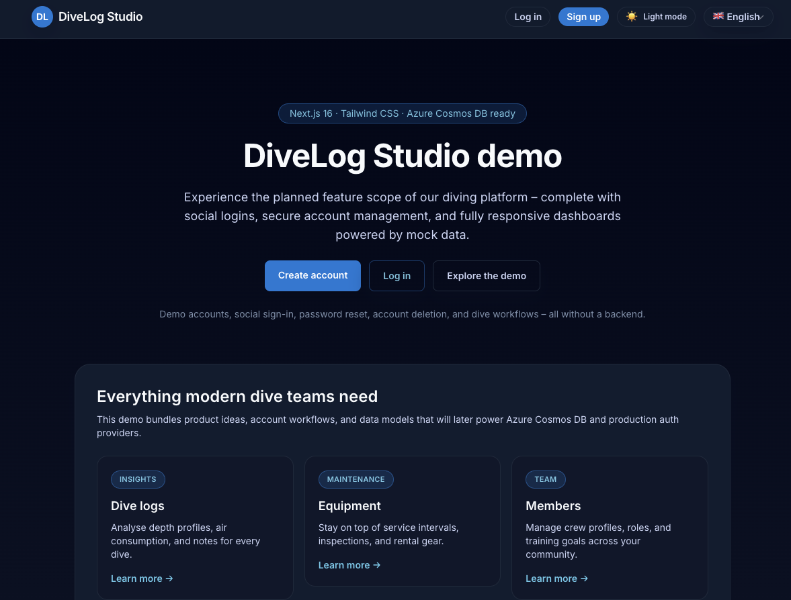

# DiveLog Studio Demo



> :uk: English content first · :de: Deutsche Fassung folgt weiter unten.

## :uk: English

### 🚀 Quickstart
```bash
npm install
npm run dev
```
Then open `http://localhost:3000`. The landing page links straight to registration, login, mock social sign-ins, and the full dashboard.

### ✨ Highlights
- Refined landing page with clear calls to action (registration, login, demo)
- **Microsoft Teams integration** - works as standalone web app AND Teams app
- Automatic Teams SSO authentication with seamless web fallback
- Social sign-in buttons for Google, Microsoft, Facebook, LinkedIn & Amazon (demo flow)
- Registration flow with real-time password confirmation and cancel option
- Password reset with validation plus account deletion and content purge
- Community, dive log, and equipment modules powered by responsive mock data

#### A Glimpse Inside The App
- Hero, feature tiles, and demo navigation at a glance
- Dashboard covering community, dive, and equipment modules
- Responsive layout illustrating mobile and desktop views

### 📋 Feature Overview**Branding & Design**
- Professional diver-themed logo with ocean gradient
- Dynamic favicon generation for browser and Apple devices
- Multiple logo variants (icon, horizontal, high-res) in `/public/assets/`
- Responsive design with dark mode support
**Landing & Marketing**
- Hero section listing the tech stack, calls to action, and supporting content
- Feature tiles for dive logs, equipment, members, and community
- “Everything for your team” spotlight highlighting auth and UX workflows

**Authentication & Account**
- Login via email/password, demo access, and social buttons
- Registration with double password entry and live mismatch feedback
- Account dashboard for password reset and account deletion (email confirmation)
- Demo data is anonymised or replaced when accounts are removed

**Dashboard Modules**
- Dive logs with filters, sequential numbers, and an add form
- Equipment, sites, community, and notifications sections with mock content
- Community posts supporting attachments, overlays, and forum entry points

### 🛠️ Tech Stack & Versions

| Technology                   | Version |
| ---------------------------- | ------- |
| Next.js                      | 16.1.3  |
| React                        | 19.2.3  |
| TypeScript                   | 5.9.3   |
| Tailwind CSS                 | 4.1.18  |
| @tailwindcss/postcss         | 4.1.18  |
| @tailwindcss/forms           | 0.5.11  |
| eslint / eslint-config-next  | 9.39.2 / 16.1.3 |
| Zod                          | 4.3.5   |
| @tanstack/react-query        | 5.90.19 |
| @azure/cosmos                | 4.9.0   |
| @microsoft/teams-js          | 2.48.0  |
| leaflet                      | 1.9.4   |
| react-leaflet                | 5.0.0   |

Additional libraries: `lucide-react` (0.562.0), `clsx` (2.1.1), `autoprefixer` (10.4.23), `postcss` (8.5.6).

### 🧭 Project Structure
- `app/` – App Router pages, layouts, and API stubs
- `app/page.tsx` – landing page
- `app/icon.tsx` – dynamic favicon generation (32x32)
- `app/apple-icon.tsx` – Apple touch icon generation (180x180)
- `app/auth/*` – login, logout, and registration screens
- `src/components/ui/app-logo.tsx` – Logo component with size variants
- `src/features/*` – feature components (auth, community, dives, etc.)
- `src/features/sites/components/dive-site-map.tsx` – Interactive map with Leaflet
- `src/providers/*` – state management for auth and demo data
- `src/data/mock-data.ts` – mock datasets including sequences and attachments
- `src/features/auth/components/social-providers.tsx` – reusable social login assets
- `public/assets/` – Logo variants (logo.svg, logo-icon.svg, logo-horizontal.svg)

### 🧪 Development Workflow
Available npm scripts:
```bash
npm run dev       # Dev server with hot reload
npm run lint      # ESLint for TS/TSX
npm run build     # Production build
npm run start     # Production server after build
npm run typecheck # TypeScript strict mode without emit
```
Recommendation: keep `npm run dev` running during development and lint frequently.

### 📦 Demo Data & Behaviour
- All data originates from `src/data/mock-data.ts` and lives on the client
- Auth flows rely on local state via `AuthProvider` (non-persistent)
- Social buttons trigger demo sign-ins (LinkedIn → admin, others → member)
- Account deletion purges logs, media, and community content while replacing blog/forum posts with placeholders
- **Dual-mode operation**: Automatically detects Teams context and adjusts UI accordingly

### 🔗 Microsoft Teams Integration
The app works seamlessly as both a standalone web app and a Microsoft Teams app:

**Web Mode (Browser)**
- Full landing page with registration/login
- Manual authentication required
- Standard web navigation

**Teams Mode (in Microsoft Teams)**
- Auto-redirects from landing page to dashboard
- Automatic SSO authentication (demo: logs in as member)
- Teams badge shown in header
- Optimized for Teams viewport

**Setup for Teams**
See [`teams-app/README.md`](teams-app/README.md) for complete instructions on:
- Azure AD app registration
- Manifest configuration
- Icon creation
- App package upload to Teams

The app uses `@microsoft/teams-js` SDK to detect context automatically—no environment variables or build flags needed.

### 🔮 Roadmap
1. Integrate Azure Cosmos DB (module containers, user/team partition keys)
2. Connect NextAuth or Entra ID for production social logins and Teams SSO validation
3. Migrate forms to React Hook Form + Zod with server-side mutations
4. Add persistent media handling via Azure Storage / Blob Storage
5. Introduce Playwright E2E tests and CI/CD integration
6. Enhanced Teams features: bot integration, meeting extensions, adaptive cards

### Closing Note
The demo gives product, design, and engineering teams a tangible preview of DiveLog Studio's experience—including core account flows, social sign-ins, dual-mode Teams integration, and an Azure-ready architecture.

---

## :de: Deutsch

### 🚀 Schnellstart
```bash
npm install
npm run dev
```
Öffne danach `http://localhost:3000`. Die Landing Page verweist auf Registrierung, Login, Social Logins (Mock) sowie das Dashboard.

### ✨ Highlights
- Überarbeitete Landing Page mit klaren Calls-to-Action (Registrierung, Login, Demo)
- **Microsoft Teams-Integration** – funktioniert als eigenständige Web-App UND Teams-App
- Automatische Teams-SSO-Authentifizierung mit nahtlosem Web-Fallback
- Social Sign-In Buttons für Google, Microsoft, Facebook, LinkedIn & Amazon (Demo-Flow)
- Registrierung mit Passwort-Bestätigung in Echtzeit und Cancel-Option
- Passwort-Reset samt Validierung und Konto-Löschung inklusive Content-Purge
- Module für Community, Dive Logs und Equipment auf Basis responsiver Mock-Daten

#### Blick in die App
- Hero, Feature-Kacheln und Demo-Navigation auf einen Blick
- Dashboard mit Community-, Dive- und Equipment-Modulen
- Responsive Layout demonstriert Mobile- und Desktop-Ansicht

### 📋 Feature-Überblick**Branding & Design**
- Professionelles Taucher-Logo mit Ozean-Farbverlauf
- Dynamische Favicon-Generierung für Browser und Apple-Geräte
- Mehrere Logo-Varianten (Icon, Horizontal, Hochauflösend) in `/public/assets/`
- Responsives Design mit Dark-Mode-Unterstützung
**Landing & Marketing**
- Hero mit Technologie-Stack, Call-to-Actions und erklärendem Secondary-Content
- Feature-Kacheln für Dive Logs, Equipment, Mitglieder und Community
- „Alles für dein Team“-Sektion mit Fokus auf Auth- und UX-Workflows

**Authentifizierung & Konto**
- Login via E-Mail/Passwort, Demo-Zugänge sowie Social Buttons
- Registrierung mit doppelter Passworteingabe und Live-Feedback
- Account-Dashboard für Passwort-Reset und Konto-Löschung (mit E-Mail-Bestätigung)
- Demo-Daten werden bei Konto-Löschung anonymisiert bzw. ersetzt

**Dashboard-Module**
- Dive Logs mit Filteroptionen, Lognummern und Formular zum Hinzufügen
- Equipment-, Site-, Community- und Notifications-Bereiche samt Mock-Content
- Community-Posts mit Attachment-Uploads, Overlays und Foren-Verlinkungen

### 🛠️ Tech-Stack & Versionen

| Technologie                  | Version |
| ---------------------------- | ------- |
| Next.js                      | 16.1.3  |
| React                        | 19.2.3  |
| TypeScript                   | 5.9.3   |
| Tailwind CSS                 | 4.1.18  |
| @tailwindcss/postcss         | 4.1.18  |
| @tailwindcss/forms           | 0.5.11  |
| eslint / eslint-config-next  | 9.39.2 / 16.1.3 |
| Zod                          | 4.3.5   |
| @tanstack/react-query        | 5.90.19 |
| @azure/cosmos                | 4.9.0   |
| @microsoft/teams-js          | 2.48.0  |
| leaflet                      | 1.9.4   |
| react-leaflet                | 5.0.0   |

Weitere Bibliotheken: `lucide-react` (0.562.0), `clsx` (2.1.1), `autoprefixer` (10.4.23), `postcss` (8.5.6).

### 🧭 Projektstruktur
- `app/` – App Router Seiten, Layouts und API-Stubs
- `app/page.tsx` – Landing Page
- `app/icon.tsx` – Dynamische Favicon-Generierung (32x32)
- `app/apple-icon.tsx` – Apple Touch Icon Generierung (180x180)
- `app/auth/*` – Login-, Logout- und Registrierungsseiten
- `src/components/ui/app-logo.tsx` – Logo-Komponente mit Größenvarianten
- `src/features/*` – Feature-Komponenten (Auth, Community, Dives usw.)
- `src/features/sites/components/dive-site-map.tsx` – Interaktive Karte mit Leaflet
- `src/providers/*` – State-Management für Auth & Demo-Daten
- `src/data/mock-data.ts` – Mock-Datensätze inklusive Sequenzen und Attachments
- `src/features/auth/components/social-providers.tsx` – Social-Login-Assets
- `public/assets/` – Logo-Varianten (logo.svg, logo-icon.svg, logo-horizontal.svg)

### 🧪 Entwicklungs-Workflow
Verfügbare NPM-Skripte:
```bash
npm run dev       # Entwicklerserver mit Hot Reload
npm run lint      # ESLint für TS/TSX
npm run build     # Produktions-Build
npm run start     # Produktiv-Server nach dem Build
npm run typecheck # TypeScript ohne Emit im Strict-Modus
```
Empfehlung: Während der Entwicklung `npm run dev` verwenden und regelmäßig `npm run lint` ausführen.

### 📦 Demo-Daten & Verhalten
- Alle Daten stammen aus `src/data/mock-data.ts` und bleiben clientseitig
- Auth-Flows nutzen einen lokalen State (`AuthProvider`) und sind nicht persistent
- Social Buttons starten Demo-Anmeldungen (LinkedIn → Admin, andere → Member)
- Konto-Löschungen bereinigen Logs, Medien und Community-Inhalte; Blog/Forum erhalten Platzhalter
- **Dual-Mode-Betrieb**: Erkennt Teams-Kontext automatisch und passt UI entsprechend an

### 🔗 Microsoft Teams-Integration
Die App funktioniert nahtlos sowohl als eigenständige Web-App als auch als Microsoft Teams-App:

**Web-Modus (Browser)**
- Vollständige Landing Page mit Registrierung/Login
- Manuelle Authentifizierung erforderlich
- Standard-Web-Navigation

**Teams-Modus (in Microsoft Teams)**
- Auto-Weiterleitung von Landing Page zum Dashboard
- Automatische SSO-Authentifizierung (Demo: Login als Member)
- Teams-Badge im Header sichtbar
- Optimiert für Teams-Viewport

**Setup für Teams**
Siehe [`teams-app/README.md`](teams-app/README.md) für vollständige Anleitung zu:
- Azure AD App-Registrierung
- Manifest-Konfiguration
- Icon-Erstellung
- App-Package-Upload zu Teams

Die App nutzt das `@microsoft/teams-js` SDK zur automatischen Kontext-Erkennung – keine Umgebungsvariablen oder Build-Flags erforderlich.

### 🔮 Nächste Schritte
1. Azure Cosmos DB integrieren (Container pro Modul, Partition Keys pro Nutzer/Team)
2. NextAuth oder Entra ID für echte Social Logins und Teams-SSO-Validierung anbinden
3. Formulare auf React Hook Form + Zod mit serverseitigen Mutationen umstellen
4. Persistente Medienverwaltung via Azure Storage / Blob Storage
5. E2E-Tests mit Playwright und CI/CD-Integration
6. Erweiterte Teams-Features: Bot-Integration, Meeting-Extensions, Adaptive Cards

### Schlusswort
Die Demo vermittelt Produktteams, Design und Engineering das geplante Erlebnis von DiveLog Studio – inklusive zentraler Account-Flows, Social Sign-Ins, Dual-Mode Teams-Integration und einer Azure-ready Architektur.
